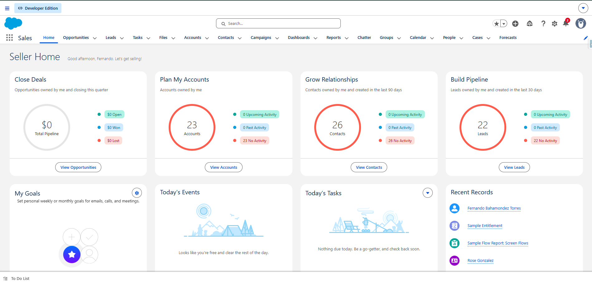

# Setup

Antes de continuar con los siguientes capítulos, el primer paso sería tener todo lo necesario para poder comenzar a realizar el análisis.

Vamos a necesitar lo siguiente:

| Tema | Subtema | Status |
|------------------------|------------------------|------------------------|
| Salesforce | Crear playground en plataforma Salesforce | {width="27"} |
| R | Instalar R | {width="27"} |
| Visual Studio Code | Instalar Visual Studio Code | {width="27"} |

## Salesforce

Al crear la playground veremos lo siguiente y al ingresar veremos lo siguiente:



Para poder ver y explorar las diferentes funcionalidades que tiene la plataforma, vamos a ir revisando técnicamente que hay detrás de la plataforma.

## R

Instalación de packages:

```{r library, eval=FALSE}
## primero se ejecuta esta instalación del package:
# install.packages("salesforcer")

## luego para tener el package activo, ejecutamos el siguiente código.
library(salesforcer)
```
