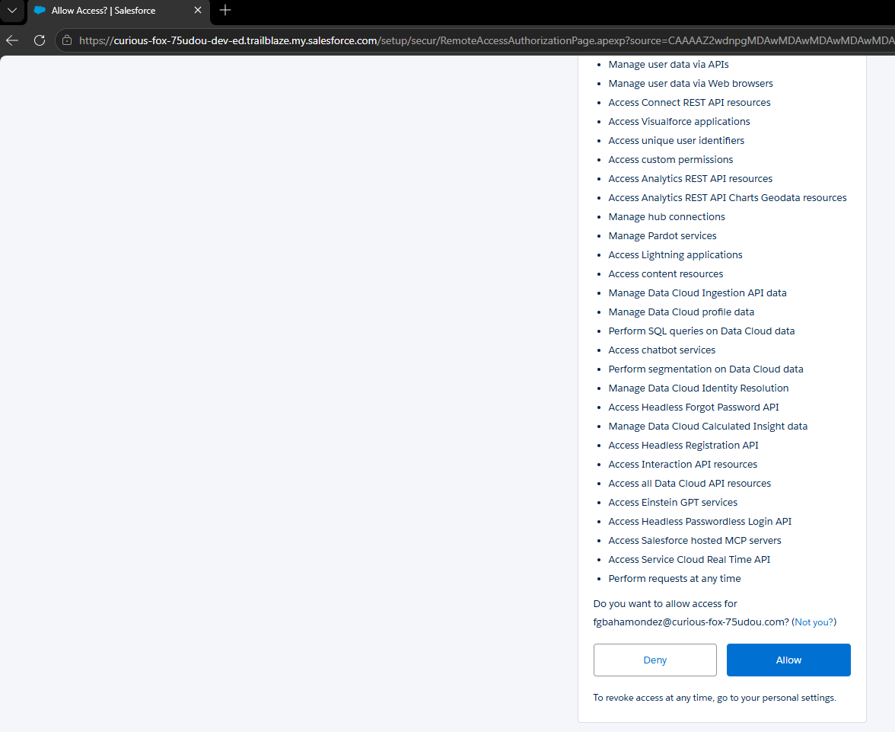
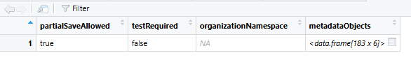

# Salesforce.org

## Integración

La primera tarea sería realizar la conexión con la plataforma, para eso vamos a utilizar lo siguiente:

### Autenticación

```{r login, eval=FALSE}
login <- sf_auth()
```





```{r login_local, eval=FALSE, echo=FALSE}
# 2. POR SEGURIDAD: Reemplazamos el token real por un texto falso
login$token <- "Token Oculto por Seguridad"

# 3. Guardamos la lista en la nueva carpeta 'data'
saveRDS(login, file = "data/sf_login_mock.rds")
```

```{r login_leer_libro, echo=FALSE}
# Este bloque OCULTA el código (echo=FALSE), pero sí se ejecuta.
# Aquí es donde leemos el archivo que guardamos localmente en nuestro Paso 2.
login_guardado <- readRDS("data/sf_login_mock.rds")

# Imprimimos el resultado para que aparezca en el libro
str(login_guardado)
```

### Capas Metadata

Del dibujo propuesto de arquitectura, vamos a utilizar una función del Package de .

Una parte fundamental de la ingeniería inversa en Salesforce es entender qué tipos de metadatos están disponibles en la instancia. La función sf_describe_metadata() nos permite obtener esta "lista de maestros".

```{r org_metadata, eval=FALSE}
## This function returns details about the organization metadata
sf_describe_metadata <- sf_describe_metadata(verbose = TRUE)
```



```{r org_metada_save_local, eval=FALSE, echo=FALSE}
# 2. "Aplanamos" la columna metadataObjects para que las 183 filas suban al nivel principal
# Usamos unnest() para expandir la lista
df_metadata_org <- sf_describe_metadata %>% 
  unnest(metadataObjects)

# 3. Guardamos el resultado en nuestra carpeta de datos
saveRDS(df_metadata_org, "data/sf_metadata_describe.rds")

# Verificamos que ahora sea un data frame normal (183 filas x 9 columnas aprox)
dim(df_metadata_org)
```

```{r org_metadata_on_libro, eval=FALSE, echo=TRUE}

# Obtenemos y aplanamos los metadatos
sf_metadata <- sf_describe_metadata(verbose = TRUE) %>% 
  unnest(metadataObjects)

# Visualizamos las primeras filas
head(sf_metadata)
```


```{r}
library(DT)
# Leemos el archivo procesado localmente
df_render <- readRDS("data/sf_metadata_describe.rds")

# Mostramos toda la tabla de forma interactiva (10 filas por página, con filtros)
datatable(df_render, 
          rownames = FALSE, 
          filter = 'top', 
          options = list(
            pageLength = 10, 
            autoWidth = TRUE,
            scrollX = TRUE
          ),
          caption = "Tipos de metadatos encontrados en la Org")
```
